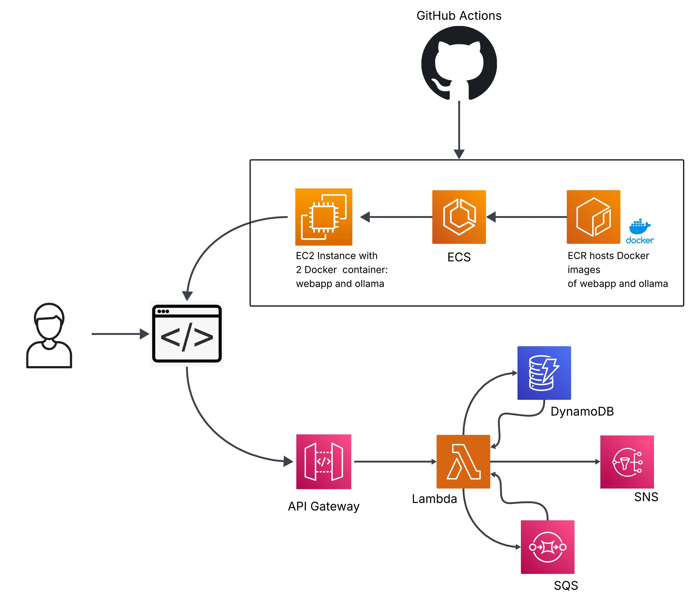

# AItinerary

AItinerary è un'applicazione web interattiva progettata per generari itinerari di viaggio personalizzati tramite l'ausilio di un modello linguistico di grandi dimensioni (LLM). Il sito presenta un'interfaccia semplice ed essenziale, pensata per facilitare l'interazione da parte dell'utente.

## Obiettivi


Il progetto nasce con l’obiettivo di approfondire l’utilizzo dei servizi offerti da Amazon Web Services, una delle piattaforme più diffuse e consolidate nel settore Cloud Computing. Lo scopo è stato quello di progettare
e realizzare una semplice applicazione cloud-native, con l’intento di comprendere in modo pratico l’interazione tra i diversi servizi AWS e le logiche architetturali alla base delle moderne applicazioni distribuite.

## Schema progetto


## Project setup

### Requisiti
- Account AWS
- Docker

### Avvio applicazione

Questo repository include uno script bash deploy.sh che al suo interno va a richiamare vari script python e bash presenti nella cartella scripts. Questi ultimi si occupano della creazione dell'infrastruttura di rete dell'applicazione, delle risorse offerte dai vari servizi AWS e del deploy dell'applicazione nel proprio account AWS.

Per avviare l'applicazione quindi:

1. **Scarica il progetto**

   ```
   git clone https://github.com/Luca683/AItinerary-cloud-systems.git
   ```

2. **Deploy applicazione**

   ```
   chmod +x deploy.sh
   ./deploy.sh
   ```
Una volta che lo script termina la sua esecuzione occorre attendere qualche minuto per far si che l'istanza EC2 dentro AWS venga avviata correttamente insieme ai servizi ECS che permetteranno di accedere all'applicazione e interagire con essa.

# Author
TeleSummary has been developed by Luca Strano, Computer Science student at Department of Mathematics and Computer Science, University of Catania, for the "Technologies for Advanced Programming" course.

Email: stranoluca469955@gmail.com